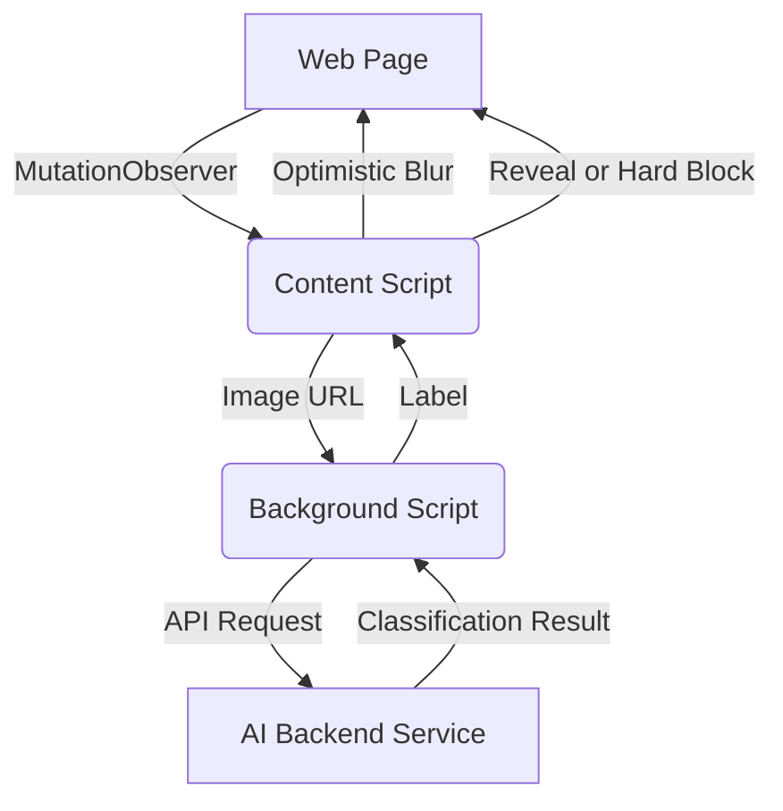

# SafeScroll - Privacy-First NSFW Blocker

SafeScroll is a powerful Chrome/Firefox extension designed to keep your browsing experience clean and distraction-free. It uses machine learning to instantly detect and blur NSFW content in your web feeds (Twitter, Reddit, etc.) before you even see it.

> [!IMPORTANT]
> **SafeScroll is now officially approved on Firefox!** 🦊  
> [**Install SafeScroll for Firefox**](https://addons.mozilla.org/en-US/firefox/addon/safescroll-nsfw-blocker/)


## 🚀 Key Features

- **Real-time Detection:** Automatically scans images as they load in your browser feed.
- **Privacy-First:** Designed to work with minimal data exposure.
- **Smart Blurring:** Instantly blurs potential NSFW content with an option to "Show Anyway".
- **Cross-Browser Support:** Available for both Chrome and Firefox.
- **Live Statistics:** Track how many images have been scanned and blocked through the extension popup.

## 🏗️ Technical Architecture

SafeScroll consists of two main components:

1.  **Browser Extension (Client):**
    - `content.js`: Monitors the DOM for new images using `MutationObserver`, applies optimistic blurring, and communicates with the background script.
    - `background.js`: Handles communication with the AI backend service.
    - `popup.js/html/css`: Provides a user interface to toggle the extension and view blocking statistics.

2.  **AI Backend (Server):**
    - `app.py`: A FastAPI-based server that hosts the image classification model.
    - **Model:** Uses the [Falconsai/nsfw_image_detection](https://huggingface.co/Falconsai/nsfw_image_detection) transformer model for high-accuracy classification.



## 🛠️ Installation & Setup

### 1. Backend Service
The backend is a FastAPI application. You can run it locally or deploy it to Hugging Face Spaces.

**Local Setup:**
```bash
# Install dependencies
pip install -r requirements.txt

# Run the server
python app.py
```
The server will start at `http://localhost:8000`.

### 2. Browser Extension
**Firefox:**
- **[Install from Firefox Add-ons Store](https://addons.mozilla.org/en-US/firefox/addon/safescroll-nsfw-blocker/)** (Recommended)
- **Manual Load:**
  1. Open Firefox and navigate to `about:debugging#/runtime/this-firefox`.
  2. Click **Load Temporary Add-on...**.
  3. Select the `manifest.json` inside the `borderify` folder.

**Chrome:**
1. Open Chrome and navigate to `chrome://extensions/`.
2. Enable **Developer mode** (top right).
3. Click **Load unpacked** and select the `extension` folder.

## ⚙️ Configuration
By default, the extension is configured to connect to a hosted Hugging Face Space:
`https://akshay-sg-safescroll.hf.space/classify`

To use your local backend, update the URL in `extension/background.js`.

## 🛡️ Privacy
SafeScroll only sends image URLs to the classification service. No user data, cookies, or history are ever tracked or stored.

## 📜 License
This project is licensed under the MIT License - see the [LICENSE](LICENSE) file for details.
